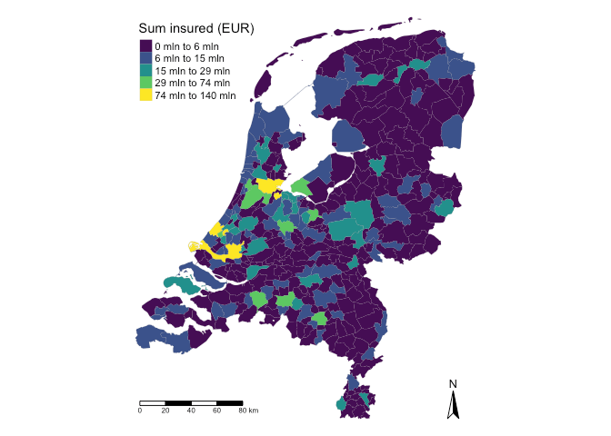

  
  <!-- README.md is generated from README.Rmd. Please edit that file -->

```{r, include = FALSE}
knitr::opts_chunk$set(
  fig.path = "man/figures/"
)
```

# spatialrisk 

<!-- badges: start -->
[](https://cran.r-project.org/package=spatialrisk)
[](https://cran.rstudio.com/package=spatialrisk)
<!-- badges: end -->

`spatialrisk` is a R-package for spatial risk calculations. It offers an efficient approach to determine the sum of all observations within a circle of a certain radius. This might be beneficial for insurers who are required (by a recent European Commission regulation) to determine the maximum value of insured fire risk policies of all buildings that are partly or fully located within a circle of a radius of 200m. The key functions in `spatialrisk` are written in C++ (using Rcpp), and are therefore very fast.

## Installation

Install `spatialrisk` from CRAN:

```{r, eval = FALSE}
install.packages("spatialrisk")
```

Or the development version from GitHub:

```{r gh-installation, eval = FALSE}
# install.packages("remotes")
remotes::install_github("MHaringa/spatialrisk")
```

```{r, include = FALSE}
library(htmltools)
library(htmlwidgets)
library(webshot)
# install_phantomjs(version = "2.1.1", baseURL = "https://github.com/wch/webshot/releases/download/v0.3.1/")
```


## Example 1

Find all observations in data.frame `Groningen` that are located within circle of a radius of 100m from the point `(lon,lat) = (6.561561,53.21326)`:

```{r example, eval = TRUE, message = FALSE, warning = FALSE}
library(spatialrisk)
circle <- points_in_circle(Groningen, lon_center = 6.571561, lat_center = 53.21326, radius = 100)
circle
```

The sum of all observations within a circle of a radius of 100m is equal to: 

```{r}

sum(circle$amount)

```

The next example shows how to determine the sum of all observations within a circle with a certain radius for multiple points. 

## Example 2

`concentration()` determines the sum of all observations within a circle of a certain radius for multiple points. Find for each row in `df` the sum of all observations in `Groningen` within a circle of a radius of 100m from the `(lon,lat)` pair:

```{r example2, eval = TRUE}

df <- data.frame(location = c("p1", "p2", "p3"), 
                 lon = c(6.561561, 6.561398, 6.571561), 
                 lat = c(53.21369, 53.21326, 53.21326))

conc <- concentration(df, Groningen, value = amount, radius = 100)
conc

```

Show that result is indeed equal to the result from Example 1:

```{r}

isTRUE(sum(circle$amount) == conc$concentration[3])

```

## Example 3

Example 2 shows how to determine the sum of all observations within a circle of certain radius for multiple points. `highest_concentration()` can be used to find the coordinates of the center of a circle for which the sum of the observations within the circle is the highest. This example gives an application to data set `Groningen`. `highest_concentration()` uses Gustavo Niemeyer's wonderful and elegant geohash coordinate system. Niemeyer's Geohash method encodes latitude and longitude as binary string where each binary value derived from a decision as to where the point lies in a bisected region of latitude or longitudinal
space. 

Note that all functions are written in C++, and are therefore very fast. It takes about 5-10 seconds to find the highest concentration for a portfolio 
with 500,000 objects. 

Show all points in data set `Groningen`:

```{r example3a, eval = FALSE, message = FALSE, warning = FALSE}

plot_points(Groningen, value = amount)

```


<br>

-----

Find the highest concentration:

```{r, eval = FALSE, echo = TRUE}

hconc <- highest_concentration(Groningen, amount, radius = 200, grid_distance = 50)

```

```{r example3b, eval = TRUE, echo = FALSE, message = FALSE, warning = FALSE}

hconc <- highest_concentration(Groningen, amount, radius = 200, grid_distance = 50, display_progress = FALSE)

```

For a portfolio of about 25,000 it takes about 0.5 second to find the highest concentration. 

```{r, eval = FALSE, echo = TRUE}

microbenchmark::microbenchmark(
  highest_concentration(Groningen, amount, radius = 200, grid_distance = 50), 
  times = 10)

```

```{r, eval = TRUE, echo = FALSE, message = FALSE, warning = FALSE}

microbenchmark::microbenchmark(
  highest_concentration(Groningen, amount, radius = 200, grid_distance = 50), 
  times = 10)

```

The two highest concentrations are found in geohash *u1kwug*:

```{r example3c}

head(hconc)

```

The following gives an illustration of this. The yellow parts show the areas with the highest concentrations. 

```{r, eval = FALSE, echo = TRUE}

plot(hconc) 

```


<br>

-----

`highest_concentration()` returns the highest concentration within a portfolio based on a grid. However, higher concentrations can be found within two grid points. `neighborhood_gh_search()` looks for even higher concentrations in the neighborhood of the grid points with the highest concentrations. This optimization is done by means of Simulated Annealing.

Look for higher concentrations in the geohash with the highest concentration found by `highest_concentration()`:

```{r, eval = FALSE, echo = TRUE}

hconc_nghb <- neighborhood_gh_search(hconc, max.call = 7000)

```

```{r, eval = TRUE, echo = FALSE}

hconc_nghb <- neighborhood_gh_search(hconc, max.call = 7000, verbose = FALSE)

```

The highest concentration is found in:

```{r}

hconc_nghb

```
The concentration 64,438 is higher than the highest concentration of 63,485 on the grid points. This concentration is the highest in data set Groningen.  

Show the highest concentration on a map (the highest concentration includes two apartment buildings with many objects):

```{r, eval = FALSE, echo = TRUE}

plot(hconc_nghb)

```


<br>

Its also possible to show the coordinates for more than one concentration. To show the second and third highest concentration:

```{r, eval = TRUE, echo = FALSE}

nb3 <- neighborhood_gh_search(hconc, max.call = 7000, highest_geohash = 3, verbose = FALSE) 

```

```{r, eval = FALSE, echo = TRUE}

nb3 <- neighborhood_gh_search(hconc, max.call = 7000, highest_geohash = 3) 
nb3


```

Create interactive map:

```{r, eval = FALSE, echo = TRUE}
plot(nb3)
```


<br>

Show objects in the highest geohash:

```{r}

points_in_circle(Groningen, lon_center = nb3$lon[1], lat_center = nb3$lat[1], radius = 200)

```


## Example 4

`spatialrisk` also contains functionality to create choropleths. Typically in R it is difficult to create choropleths. `points_to_polygon()` attempts to elegantly solve this problem.

The common approach is to first aggregate the data on the level of the regions in the shapefile, and then merging the aggregated data with the shapefile. Despite it being common, it is problematic in case the names in the data and the names in the shapefile do not match. This is for example the case when there are differences in punctuation marks in the area names. Therefore, `points_to_polygon()` uses the longitude and latitude of a point to map this point to a region. This approach makes it easy to create choropleth maps on different region levels.

This example shows how `points_to_polygon()` is used to map the total sum insured on the municipality level in the Netherlands: 

```{r example4, eval = FALSE, message = FALSE, warning = FALSE}

gemeente_sf <- points_to_polygon(nl_gemeente, insurance, sum(amount, na.rm = TRUE))

```

`choropleth()` creates a map based on the simple feature object obtained in the previous step. There are two options to create a choropleth map. When `mode` is set to `plot` a static map is created. The given clustering is according to the Fisher-Jenks algorithm. This commonly used classification method for choropleths seeks to reduce the variance within classes and maximize the variance between classes.

```{r example4b, eval = FALSE, message = FALSE, warning = FALSE}
choropleth(gemeente_sf, mode = "plot", legend_title = "Sum insured (EUR)", n = 5)
```



<br>

If `mode` is set to `view` an interactive map is created:

```{r example4c, eval = FALSE, echo = TRUE}
choropleth(gemeente_sf, mode = "view", legend_title = "Sum insured (EUR)")
```


<br>

The following simple feature objects are available in `spatialrisk`: `nl_provincie`, `nl_corop`, `nl_gemeente`, `nl_postcode1`, `nl_postcode2`, `nl_postcode3`, `nl_postcode4`, `world_countries`, and `europe_countries`.
