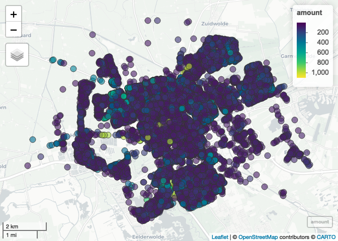

  
  <!-- README.md is generated from README.Rmd. Please edit that file -->

```{r, include = FALSE}
knitr::opts_chunk$set(
  fig.path = "man/figures/"
)
```

# spatialrisk 

<!-- badges: start -->
[](https://cran.r-project.org/package=spatialrisk)
[](https://cran.rstudio.com/package=spatialrisk)
<!-- badges: end -->

`spatialrisk` is a R-package for spatial risk calculations. It offers an efficient approach to determine the sum of all observations within a circle of a certain radius. This might be beneficial for insurers who are required (by a recent European Commission regulation) to determine the maximum value of insured fire risk policies of all buildings that are partly or fully located within a circle of a radius of 200m. The key functions in `spatialrisk` are written in C++ (using Rcpp), and are therefore very fast.

## Installation

Install `spatialrisk` from CRAN:

```{r, eval = FALSE}
install.packages("spatialrisk")
```

Or the development version from GitHub:

```{r gh-installation, eval = FALSE}
# install.packages("remotes")
remotes::install_github("MHaringa/spatialrisk")
```

```{r, include = FALSE}
library(htmltools)
library(htmlwidgets)
library(webshot)
# install_phantomjs(version = "2.1.1", baseURL = "https://github.com/wch/webshot/releases/download/v0.3.1/")
```


## Example 1

Filter all observations in `Groningen` that fall within a circle of a radius of 100m drawn around the point `(lon,lat) = (6.561561,53.21326)`:

```{r example, eval = TRUE, message = FALSE, warning = FALSE}
library(spatialrisk)
circle <- points_in_circle(Groningen, lon_center = 6.571561, lat_center = 53.21326, radius = 100)
circle
```

The sum of all observations within this circle is equal to: 

```{r}

sum(circle$amount)

```

The next example shows how to determine the sum of all observations within a circle with a certain radius for multiple points. 

## Example 2

`concentration()` determines the sum of all observations within a circle of a certain radius for multiple points. Find for each row in `df` the sum of all observations in `Groningen` within a circle of a radius of 100m from the `(lon,lat)` pair:

```{r example2, eval = TRUE}

df <- data.frame(location = c("p1", "p2", "p3"), 
                 lon = c(6.561561, 6.561398, 6.571561), 
                 lat = c(53.21369, 53.21326, 53.21326))

conc <- concentration(df, Groningen, value = amount, radius = 100)
conc

```

Show that result is indeed equal to the result from Example 1:

```{r}

isTRUE(sum(circle$amount) == conc$concentration[3])

```

## Example 3

Example 2 shows how to determine the sum of all observations within a circle of certain radius for multiple points. `find_highest_concentration()` can be used to determine the central coordinates of a circle with a constant radius that maximizes the coverage of demand points. As an example this is applied to data set `Groningen`. 

Show all points in data set `Groningen`:

```{r example3a, eval = FALSE, message = FALSE, warning = FALSE}

plot_points(Groningen, value = "amount")

```



<br>

-----

Find the central coordinates of a circle with the highest concentration:

```{r, eval = FALSE, echo = TRUE}

hconc <- find_highest_concentration(Groningen, 
                                    value = "amount", 
                                    radius = 200)

```

```{r, echo = FALSE, eval = TRUE, message = FALSE, warning = FALSE}

st <- Sys.time()
hc <- spatialrisk::find_highest_concentration(spatialrisk::Groningen, "amount")
print(Sys.time() - st)

```

Note that all functions are written in C++, and are therefore very fast. 

Output highest concentration:

```{r}

hc[[1]]

```

Plot the points in the highest concentration highest concentration. The sum of all values is equal to the concentration. This concentration is the highest in data set Groningen.  

Show the highest concentration on a map (the highest concentration includes two apartment buildings with many objects):

```{r, echo = TRUE, eval = FALSE}

plot(hc)

```


<br>

-----


Its also possible to show the coordinates for more than one concentration. To show the second and third highest concentration:

```{r, eval = TRUE, echo = TRUE}

hconc <- find_highest_concentration(Groningen, 
                                    value = "amount", 
                                    radius = 200, 
                                    top_n = 3)

```

Create interactive map:

```{r, eval = FALSE, echo = TRUE}

plot(hconc)

```


<br>

-----

Show objects in the highest circle:

```{r}

hc[[2]]

```


## Example 4

`spatialrisk` also contains functionality to create choropleths. Typically in R it is difficult to create choropleths. `points_to_polygon()` attempts to elegantly solve this problem.

The common approach is to first aggregate the data on the level of the regions in the shapefile, and then merging the aggregated data with the shapefile. Despite it being common, it is problematic in case the names in the data and the names in the shapefile do not match. This is for example the case when there are differences in punctuation marks in the area names. Therefore, `points_to_polygon()` uses the longitude and latitude of a point to map this point to a region. This approach makes it easy to create choropleth maps on different region levels.

This example shows how `points_to_polygon()` is used to map the total sum insured on the municipality level in the Netherlands: 

```{r example4, eval = FALSE, message = FALSE, warning = FALSE}

gemeente_sf <- points_to_polygon(nl_gemeente, insurance, sum(amount, na.rm = TRUE))

```

`choropleth()` creates a map based on the simple feature object obtained in the previous step. There are two options to create a choropleth map. When `mode` is set to `plot` a static map is created. The given clustering is according to the Fisher-Jenks algorithm. This commonly used classification method for choropleths seeks to reduce the variance within classes and maximize the variance between classes.

```{r example4b, eval = FALSE, message = FALSE, warning = FALSE}
choropleth(gemeente_sf, mode = "plot", legend_title = "Sum insured (EUR)", n = 5)
```


<br>

If `mode` is set to `view` an interactive map is created:

```{r example4c, eval = FALSE, echo = TRUE}
choropleth(gemeente_sf, mode = "view", legend_title = "Sum insured (EUR)")
```


<br>

The following simple feature objects are available in `spatialrisk`: `nl_provincie`, `nl_corop`, `nl_gemeente`, `nl_postcode1`, `nl_postcode2`, `nl_postcode3`, `nl_postcode4`, `world_countries`, and `europe_countries`.
