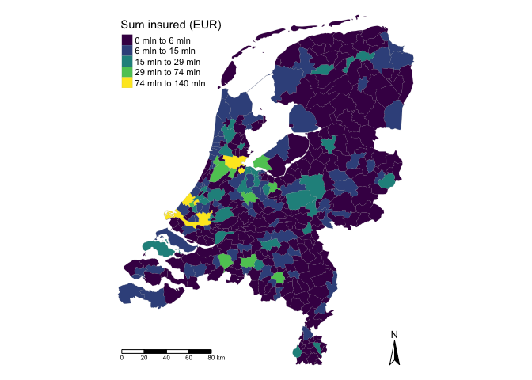
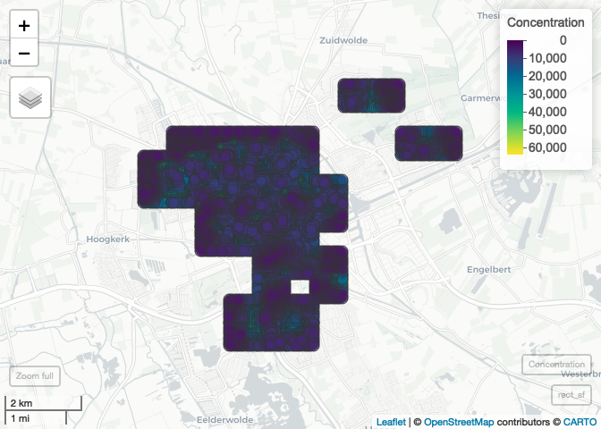

<!-- README.md is generated from README.Rmd. Please edit that file -->

# spatialrisk 

<!-- badges: start -->

[](https://cran.r-project.org/package=spatialrisk)
[](https://cran.rstudio.com/package=spatialrisk)
<!-- badges: end -->

spatialrisk is an R-package for spatial risk calculations. In
particular, it can be used to determine concentration risk in the
context of Solvency II.

The package offers an effective approach to calculate the *standard
formula* under Solvency II. The *standard formula* under Solvency II
asks insurance companies to report their largest fire concentration in
respect of the fire peril within a radius of 200m. This is the maximum
gross sum insured of the set of buildings fully or partly located within
this radius.

## Installation

Install spatialrisk from CRAN:

``` r
install.packages("spatialrisk")
```

Or the development version from GitHub:

``` r
# install.packages("remotes")
remotes::install_github("MHaringa/spatialrisk")
```

## Example 1

Find all observations in dataframe `Groningen` within a radius of 50m
from the point (lon,lat) = (6.561561,53.21326):

``` r
library(spatialrisk)
points_in_circle(Groningen, lon_center = 6.571561, lat_center = 53.21326, radius = 50)
```

    ## # A tibble: 3 x 10
    ##   street   number letter suffix postal_code city     lon   lat amount distance_m
    ##   <chr>     <int> <chr>  <chr>  <chr>       <chr>  <dbl> <dbl>  <dbl>      <dbl>
    ## 1 Heresin…      5 <NA>   <NA>   9711EP      Groni…  6.57  53.2      5       31.4
    ## 2 Heresin…      3 a      <NA>   9711EP      Groni…  6.57  53.2     36       38.1
    ## 3 Heresin…     11 <NA>   <NA>   9711ER      Groni…  6.57  53.2     11       47.8

## Example 2

Find for each row in dataframe `df` the observations in dataframe
`Groningen` within a radius of 100m from the lon/lat pair. Subsequently,
the sum of the column `amount` is taken for the obtained observations.

``` r
df <- data.frame(location = c("p1", "p2"), 
                 lon = c(6.561561, 6.561398), 
                 lat = c(53.21369, 53.21326))

concentration(df, Groningen, value = amount, radius = 100)
```

    ##   location      lon      lat concentration
    ## 1       p1 6.561561 53.21369          2055
    ## 2       p2 6.561398 53.21326          2892

## Example 3

`spatialrisk` also contains functionality to create choropleths.
Typically in R it is difficult to create choropleths. The functions
presented here attempt to elegantly solve this problem.

The common approach is to first aggregate the data on the level of the
regions in the shapefile and then merging the aggregated data with the
shapefile. This is done by joining on the name. This approach is often
problematic. For example, in case of municipality names in the
Netherlands it is not easy to merge municipality names in the shapefile
with the names in the data set. This is hard because of municipal
reorganizations or differences in punctuation marks in municipality
names. To solve this problem the data is not aggregated on the level of
the regions in the shapefile. Contrary, the functions in this package
detect directly the region containing the coordinates of the underlying
object. This flexible approach makes it easy to create choropleth maps
on different region levels.

The package has the following build-in choropleth maps:

  - nl\_provincie
  - nl\_corop
  - nl\_gemeente
  - nl\_postcode1
  - nl\_postcode2
  - nl\_postcode3
  - nl\_postcode4
  - world\_countries
  - europe\_countries

Data set `insurance` contains 30,000 postal codes with their sum
insured, population and the corresponding longitude and latitude. The
following code shows how to create a simple feature object on the
municipality (Dutch: *gemeente*) level. The regions are shaded by the
total sum insured per
region.

``` r
gemeente_sf <- points_to_polygon(nl_gemeente, insurance, sum(amount, na.rm = TRUE))
```

    ## 33 points fall not within a polygon.

`choropleth()` creates a map based on the simple feature object obtained
in the previous step. There are two options to create a choropleth map.
When `mode` is set to `plot` a static map is created:

``` r
choropleth(gemeente_sf, mode = "plot")
```

    ## Linking to GEOS 3.7.2, GDAL 2.4.2, PROJ 5.2.0

<!-- -->

If `mode` is set to `view` an interactive map is created:

``` r
choropleth(gemeente_sf, mode = "view")
```

<!-- -->
