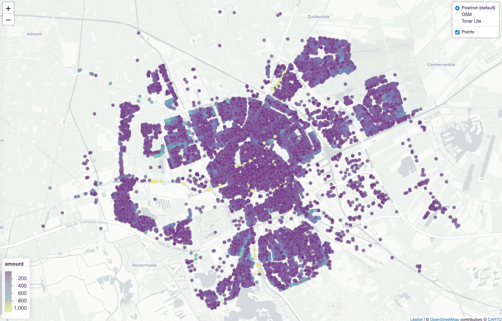
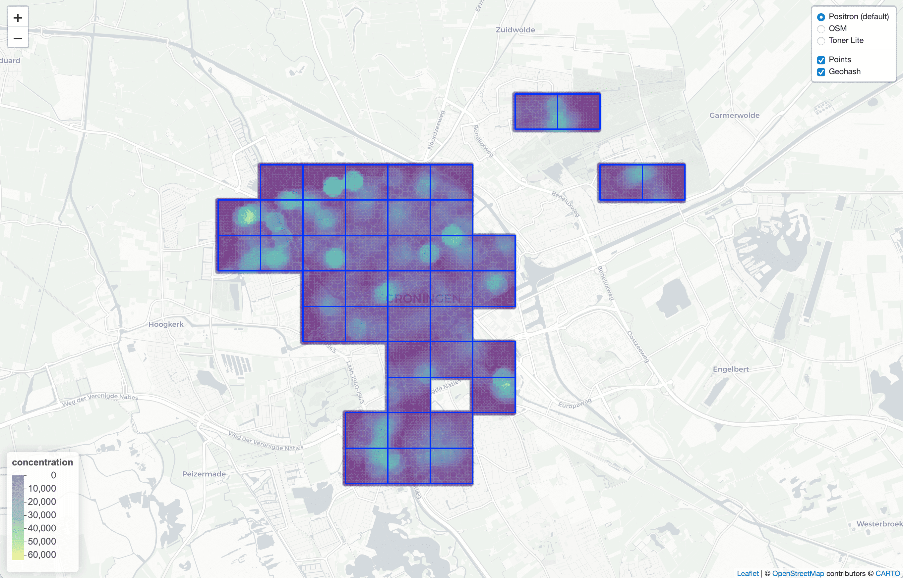
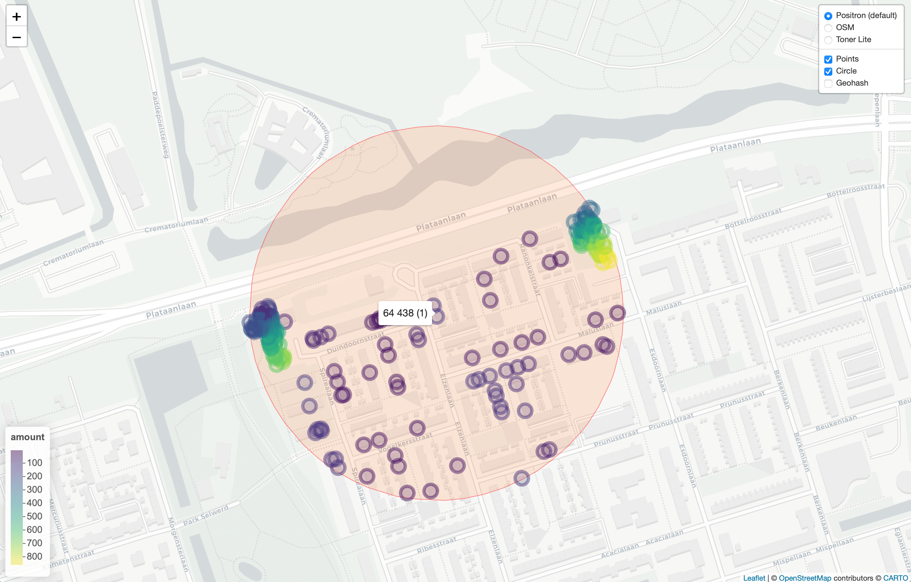
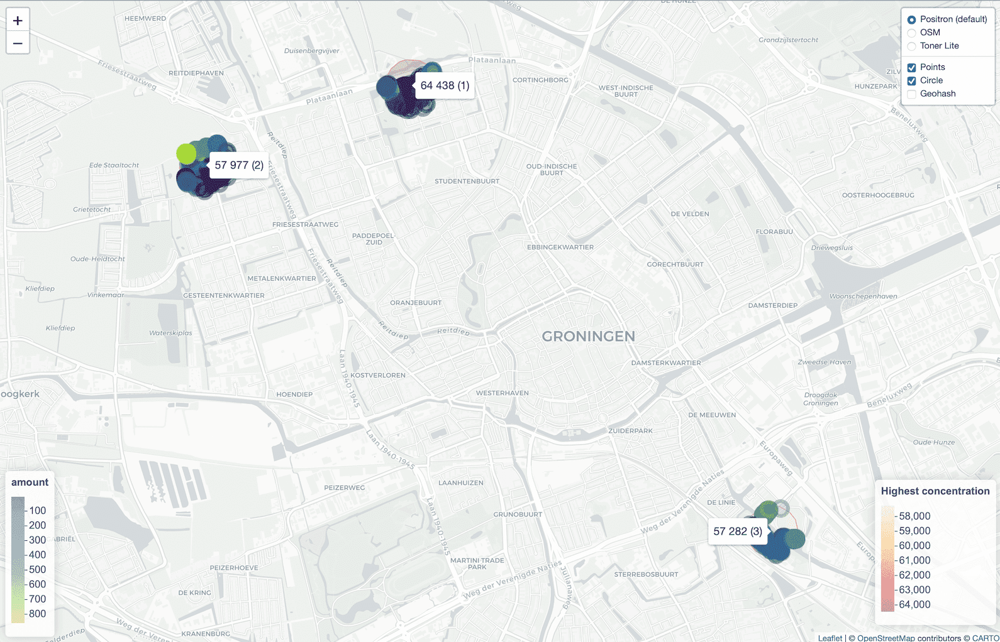

<!-- README.md is generated from README.Rmd. Please edit that file -->

# spatialrisk 

<!-- badges: start -->

[](https://cran.r-project.org/package=spatialrisk)
[](https://cran.rstudio.com/package=spatialrisk)
<!-- badges: end -->

`spatialrisk` is a R-package for spatial risk calculations. It offers an
efficient approach to determine the sum of all observations within a
circle of a certain radius. This might be beneficial for insurers who
are required (by a recent European Commission regulation) to determine
the maximum value of insured fire risk policies of all buildings that
are partly or fully located within a circle of a radius of 200m. The key
functions in `spatialrisk` are written in C++ (using Rcpp), and are
therefore very fast.

## Installation

Install `spatialrisk` from CRAN:

``` r
install.packages("spatialrisk")
```

Or the development version from GitHub:

``` r
# install.packages("remotes")
remotes::install_github("MHaringa/spatialrisk")
```

## Example 1

Find all observations in data.frame `Groningen` that are located within
circle of a radius of 100m from the point
`(lon,lat) = (6.561561,53.21326)`:

``` r
library(spatialrisk)
circle <- points_in_circle(Groningen, lon_center = 6.571561, lat_center = 53.21326, radius = 100)
circle
```

    ## # A tibble: 14 x 10
    ##    street  number letter suffix postal_code city     lon   lat amount distance_m
    ##    <chr>    <int> <chr>  <chr>  <chr>       <chr>  <dbl> <dbl>  <dbl>      <dbl>
    ##  1 Heresi…      5 <NA>   <NA>   9711EP      Groni…  6.57  53.2      5       31.4
    ##  2 Heresi…     11 <NA>   <NA>   9711ER      Groni…  6.57  53.2     11       47.8
    ##  3 Zuider…   1003 <NA>   <NA>   9724AK      Groni…  6.57  53.2   1003       57.6
    ##  4 Heresi…     13 <NA>   <NA>   9711ER      Groni…  6.57  53.2     13       68.1
    ##  5 Herepl…     10 <NA>   <NA>   9711GA      Groni…  6.57  53.2     10       74.6
    ##  6 Heresi…     16 <NA>   <NA>   9711ES      Groni…  6.57  53.2     16       84.1
    ##  7 Heresi…      6 <NA>   <NA>   9711ES      Groni…  6.57  53.2      6       86.2
    ##  8 Heresi…      6 a      <NA>   9711ES      Groni…  6.57  53.2      6       87.8
    ##  9 Heresi…      6 b      <NA>   9711ES      Groni…  6.57  53.2      6       90.9
    ## 10 Heresi…     20 <NA>   <NA>   9711ET      Groni…  6.57  53.2     20       91.5
    ## 11 Heresi…     20 a      <NA>   9711ET      Groni…  6.57  53.2     20       93.0
    ## 12 Heresi…     15 a      <NA>   9711ER      Groni…  6.57  53.2     15       95.1
    ## 13 Zuider…   1007 <NA>   <NA>   9724AK      Groni…  6.57  53.2   1007       97.2
    ## 14 Zuider…     25 a      <NA>   9724AJ      Groni…  6.57  53.2     25       97.8

The sum of all observations within a circle of a radius of 100m is equal
to:

``` r
sum(circle$amount)
```

    ## [1] 2163

The next example shows how to determine the sum of all observations
within a circle with a certain radius for multiple points.

## Example 2

`concentration()` determines the sum of all observations within a circle
of a certain radius for multiple points. Find for each row in `df` the
sum of all observations in `Groningen` within a circle of a radius of
100m from the `(lon,lat)` pair:

``` r
df <- data.frame(location = c("p1", "p2", "p3"), 
                 lon = c(6.561561, 6.561398, 6.571561), 
                 lat = c(53.21369, 53.21326, 53.21326))

conc <- concentration(df, Groningen, value = amount, radius = 100)
conc
```

    ##   location      lon      lat concentration
    ## 1       p1 6.561561 53.21369           775
    ## 2       p2 6.561398 53.21326          2271
    ## 3       p3 6.571561 53.21326          2163

Show that result is indeed equal to the result from Example 1:

``` r
isTRUE(sum(circle$amount) == conc$concentration[3])
```

    ## [1] TRUE

## Example 3

Example 2 shows how to determine the sum of all observations within a
circle of certain radius for multiple points. `highest_concentration()`
can be used to find the coordinates of the center of a circle for which
the sum of the observations within the circle is the highest. This
example gives an application to data set `Groningen`.
`highest_concentration()` uses Gustavo Niemeyer’s wonderful and elegant
geohash coordinate system. Niemeyer’s Geohash method encodes latitude
and longitude as binary string where each binary value derived from a
decision as to where the point lies in a bisected region of latitude or
longitudinal space.

Note that all functions are written in C++, and are therefore very fast.
It takes about 5-10 seconds to find the highest concentration for a
portfolio with 500,000 objects.

Show all points in data set `Groningen`:

``` r
plot_points(Groningen, value = amount)
```



<br>

------------------------------------------------------------------------

Find the highest concentration:

``` r
hconc <- highest_concentration(Groningen, amount, radius = 200, grid_distance = 50)
```

For a portfolio of about 25,000 it takes about 0.5 second to find the
highest concentration.

``` r
microbenchmark::microbenchmark(
  highest_concentration(Groningen, amount, radius = 200, grid_distance = 50), 
  times = 10)
```

    ## Unit: milliseconds
    ##                                                                        expr
    ##  highest_concentration(Groningen, amount, radius = 200, grid_distance = 50)
    ##       min      lq     mean   median      uq      max neval
    ##  607.2644 610.643 621.2857 614.1885 616.193 696.9701    10

The two highest concentrations are found in geohash *u1kwug*:

``` r
head(hconc)
```

    ##    concentration      lon      lat geohash
    ## 1:         63485 6.547372 53.23650  u1kwug
    ## 2:         61075 6.547372 53.23695  u1kwug
    ## 3:         57121 6.523147 53.23101  u1kwu6
    ## 4:         57009 6.589809 53.20534  u1kwtv
    ## 5:         56336 6.589809 53.20579  u1kwtv
    ## 6:         55631 6.523897 53.23145  u1kwu6

The following gives an illustration of this. The yellow parts show the
areas with the highest concentrations.

``` r
plot(hconc) 
```



<br>

------------------------------------------------------------------------

`highest_concentration()` returns the highest concentration within a
portfolio based on a grid. However, higher concentrations can be found
within two grid points. `neighborhood_gh_search()` looks for even higher
concentrations in the neighborhood of the grid points with the highest
concentrations. This optimization is done by means of Simulated
Annealing.

Look for higher concentrations in the geohash with the highest
concentration found by `highest_concentration()`:

``` r
hconc_nghb <- neighborhood_gh_search(hconc, max.call = 7000)
```

The highest concentration is found in:

``` r
hconc_nghb
```

    ##   highest_concentration      lon      lat geohash
    ## 1                 64438 6.547329 53.23658  u1kwug

The concentration 64,438 is higher than the highest concentration of
63,485 on the grid points. This concentration is the highest in data set
Groningen.

Show the highest concentration on a map (the highest concentration
includes two apartment buildings with many objects):

``` r
plot(hconc_nghb)
```



<br>

Its also possible to show the coordinates with for example the three
highest concentrations:

``` r
neighborhood_gh_search(hconc, max.call = 7000, highest_geohash = 3) %>%
  plot()
```



<br>

## Example 4

`spatialrisk` also contains functionality to create choropleths.
Typically in R it is difficult to create choropleths.
`points_to_polygon()` attempts to elegantly solve this problem.

The common approach is to first aggregate the data on the level of the
regions in the shapefile, and then merging the aggregated data with the
shapefile. Despite it being common, it is problematic in case the names
in the data and the names in the shapefile do not match. This is for
example the case when there are differences in punctuation marks in the
area names. Therefore, `points_to_polygon()` uses the longitude and
latitude of a point to map this point to a region. This approach makes
it easy to create choropleth maps on different region levels.

This example shows how `points_to_polygon()` is used to map the total
sum insured on the municipality level in the Netherlands:

``` r
gemeente_sf <- points_to_polygon(nl_gemeente, insurance, sum(amount, na.rm = TRUE))
```

`choropleth()` creates a map based on the simple feature object obtained
in the previous step. There are two options to create a choropleth map.
When `mode` is set to `plot` a static map is created. The given
clustering is according to the Fisher-Jenks algorithm. This commonly
used classification method for choropleths seeks to reduce the variance
within classes and maximize the variance between classes.

``` r
choropleth(gemeente_sf, mode = "plot", legend_title = "Sum insured (EUR)", n = 5)
```

<!-- -->

If `mode` is set to `view` an interactive map is created:

``` r
choropleth(gemeente_sf, mode = "view", legend_title = "Sum insured (EUR)")
```

<!-- -->

The following simple feature objects are available in `spatialrisk`:
`nl_provincie`, `nl_corop`, `nl_gemeente`, `nl_postcode1`,
`nl_postcode2`, `nl_postcode3`, `nl_postcode4`, `world_countries`, and
`europe_countries`.
