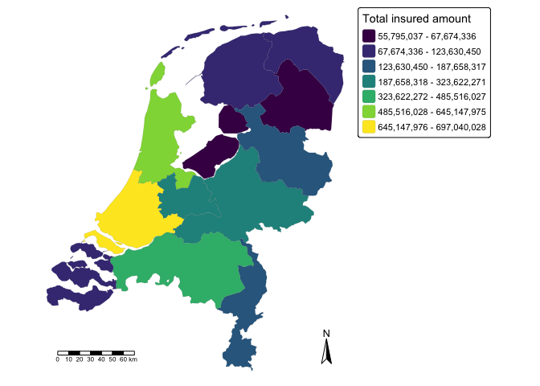

<!-- README.md is generated from README.Rmd. Please edit that file -->

# spatialrisk 

<!-- badges: start -->

[](https://cran.r-project.org/package=spatialrisk)
[](https://cran.r-project.org/package=spatialrisk)

<!-- badges: end -->

`spatialrisk` provides tools for fixed-radius spatial aggregation and
concentration analysis in R. The package is aimed at applied workflows
in which point-level values must be aggregated locally, for example to
identify exposure concentration hotspots under a chosen radius.

The central question is practical: given a portfolio of point locations
with associated values, which locations have the largest total value
within a circle of fixed radius? Mathematically, this is a weighted
fixed-radius circle-placement problem from computational geometry,
applied here to spatial exposure data. Insurance concentration analysis
is one natural application, but the same building blocks can be used for
other weighted point data analysed within fixed-distance neighbourhoods.

## Main operations

The package is intentionally focused on a small set of operations.

1.  fixed-radius calculations: identify points and compute sums within a
    radius;
2.  hotspot detection: find locations with maximum local concentration;
3.  polygon-based summaries and reporting: aggregate point exposures to
    reporting areas;
4.  supporting spatial data and utilities for reproducible workflows.

These operations are composable building blocks for applied
concentration analyses rather than a prescribed business process or a
general spatial modelling framework.

## Quick start

``` r
install.packages("spatialrisk")

# Development version
remotes::install_github("MHaringa/spatialrisk")
```

The package includes example address-level data for Groningen. The
column `amount` represents an example value attached to each location.
The parameter choices in the examples are illustrative; in practice, the
relevant radius, value column, and reporting boundaries depend on the
analytical question.

``` r
library(spatialrisk)

portfolio <- Groningen
head(portfolio[, c("lon", "lat", "amount")])
#> # A tibble: 6 × 3
#>     lon   lat amount
#>   <dbl> <dbl>  <dbl>
#> 1  6.57  53.2     24
#> 2  6.55  53.2     33
#> 3  6.57  53.2     48
#> 4  6.56  53.2      7
#> 5  6.57  53.2     16
#> 6  6.56  53.2     28
```

## Find the largest concentration

`concentration_hotspot()` searches for the centre of a fixed-radius
circle with the largest aggregated value. In an insurance setting this
can be used to identify local portfolio concentrations under a chosen
analytical radius.

``` r
hotspot <- concentration_hotspot(
  portfolio,
  value = "amount",
  radius = 200,
  cell_size = 100,
  progress = FALSE
)

hotspot
#> <hotspot>
#> Number of hotspots: 1 
#> Radius: 200 meters
#> Value: amount 
#> 
#>   id      lon      lat amount_sum
#> 1  1 6.547318 53.23659      64438
```

The result contains the selected centre coordinates and the
corresponding summed value, named from `value`; for example
`amount_sum`. The contributing observations are stored in
`hotspot$contributing_points`.

## Inspect and evaluate local concentrations

The lower-level radius functions support inspection and custom
workflows. The hotspot object already stores the observations that
contribute to the selected concentration.

``` r
head(hotspot$contributing_points[, c("id", "data_row", "lon", "lat",
                                     "amount", "amount_sum")])
#>   id data_row      lon      lat amount amount_sum
#> 1  1     1492 6.545297 53.23569    148      64438
#> 2  1     4703 6.545482 53.23547    132      64438
#> 3  1    18287 6.545429 53.23546    130      64438
#> 4  1    19958 6.545392 53.23543    138      64438
#> 5  1    22587 6.545493 53.23545    142      64438
#> 6  1       19 6.544724 53.23646    411      64438
sum(hotspot$contributing_points$amount)
#> [1] 64438
```

For a known or externally specified centre, `points_within_radius()`
returns the observations that fall within the selected radius.

``` r
known_centre_points <- points_within_radius(
  portfolio,
  lon_center = 6.5549,
  lat_center = 53.1942,
  radius = 200
)

nrow(known_centre_points)
#> [1] 110
sum(known_centre_points$amount)
#> [1] 25668
```

`radius_sum()` evaluates the same fixed-radius sum for one or more
target locations. This is useful for evaluating known centres,
externally specified locations, or candidate points created in a custom
analysis.

``` r
targets <- portfolio[1:5, c("lon", "lat")]

radius_sum(
  targets = targets,
  reference = portfolio,
  value = "amount",
  radius = 200,
  progress = FALSE,
  result_col = "amount_200m"
)
#> # A tibble: 5 × 3
#>     lon   lat amount_200m
#>   <dbl> <dbl>       <dbl>
#> 1  6.57  53.2        8612
#> 2  6.55  53.2       16704
#> 3  6.57  53.2        9120
#> 4  6.56  53.2        7970
#> 5  6.57  53.2        8633
```

The hotspot search can also be run as a decomposed workflow using
lower-level preparation, candidate-selection, and optimisation
functions. Direct optimisation of a prepared object provides the
complete geometric reference search for small validation problems under
the documented assumptions; optimisation after candidate selection uses
the screened candidate state. Candidate selection restricts candidate
generation, not which active portfolio records contribute to a
candidate’s value. See the fixed-radius concentration vignette for
details and computational limitations.

## Continuous versus observed centres

The default continuous method can place the circle centre between
buildings. For comparison, `method = "observed"` searches only observed
point locations as possible centres and is therefore useful as a fast
benchmark.

``` r
observed_hotspot <- concentration_hotspot(
  portfolio,
  value = "amount",
  radius = 200,
  method = "observed",
  progress = FALSE
)

rbind(
  continuous = hotspot$hotspots,
  observed = observed_hotspot$hotspots
)
#>            id      lon      lat amount_sum
#> continuous  1 6.547318 53.23659      64438
#> observed    1 6.547288 53.23664      64172
```

This compact comparison illustrates that the maximum fixed-radius
concentration does not necessarily need to be centred on an observed
risk location.

## Polygon-based reporting

Point-level concentration analysis is often followed by reporting at an
administrative or portfolio-management level. For that purpose,
`summarise_points_by_polygon()` joins points to polygons and summarises
a numeric value.

``` r
province_summary <- summarise_points_by_polygon(
  polygons = nl_provincie,
  points = insurance,
  value = "amount",
  fun = sum,
  outside = "ignore"
)

head(sf::st_drop_geometry(province_summary)[, c("areaname", "amount_sum")])
#>     areaname amount_sum
#> 1    Drenthe   56766689
#> 2  Flevoland   55795037
#> 3  Friesland   78581984
#> 4 Gelderland  269468412
#> 5  Groningen  106580080
#> 6    Limburg  140680821
```

For polygon maps, use `choropleth()` on the aggregated `sf` object. The
visualisation vignette shows the full point-to-polygon reporting
workflow.

``` r
choropleth(
  province_summary,
  value = "amount_sum",
  id = "areaname",
  legend_title = "Total insured amount"
)
```



## Where to go next

- Fixed-radius concentration analysis:
  `vignette("fixed-radius-concentration", package = "spatialrisk")`
- Polygon aggregation and maps:
  `vignette("visualisation", package = "spatialrisk")`
- Function reference:
  <https://mharinga.github.io/spatialrisk/reference/>

## Scope

`spatialrisk` does not estimate a statistical model and does not assign
a probability distribution to the observed values. It provides
deterministic spatial aggregation tools for fixed-radius concentration
and polygon-based reporting workflows. Interpretation of the resulting
concentration measures remains application-specific. The examples in
this documentation illustrate generic spatial-analysis techniques and
example-specific parameter choices. They are not intended to represent
the methodology, processes, assumptions, thresholds, or practices of any
particular organisation.

Core computations are implemented in C++ via Rcpp for efficient
evaluation on larger point datasets.

## Reference

The fixed-radius circle-placement problem is discussed by Chazelle and
Lee (1986): Chazelle, B. M. and Lee, D. T. (1986). On a circle placement
problem. Computing, 36(1–2), 1–16.
[doi:10.1007/BF02238188](https://doi.org/10.1007/BF02238188).

Related maximum covering location problems are described by Church
(1974) [doi:10.1007/BF01942293](https://doi.org/10.1007/BF01942293).

If you use this package in academic work, it can be cited as:

> Haringa, M. (2026). spatialrisk: Spatial concentration and
> radius-based risk calculations in R.
