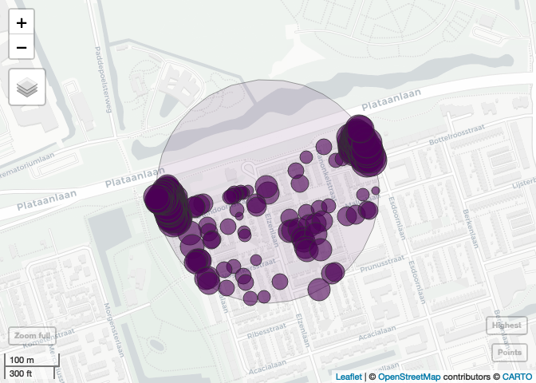
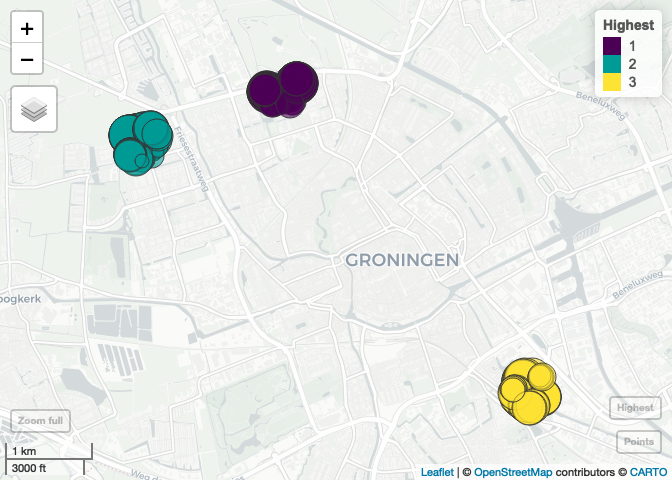

<!-- README.md is generated from README.Rmd. Please edit that file -->

# spatialrisk 

<!-- badges: start -->

[](https://cran.r-project.org/package=spatialrisk)
[](https://cran.rstudio.com/package=spatialrisk)
<!-- badges: end -->

`spatialrisk` is a R-package for spatial risk calculations. It offers an
efficient approach to determine the sum of all observations within a
circle of a certain radius. This might be beneficial for insurers who
are required (by a recent European Commission regulation) to determine
the maximum value of insured fire risk policies of all buildings that
are partly or fully located within a circle of a radius of 200m. The key
functions in `spatialrisk` are written in C++ (using Rcpp), and are
therefore very fast.

## Installation

Install `spatialrisk` from CRAN:

``` r
install.packages("spatialrisk")
```

Or the development version from GitHub:

``` r
# install.packages("remotes")
remotes::install_github("MHaringa/spatialrisk")
```

## Example 1

Filter all observations in `Groningen` that fall within a circle of a
radius of 100m drawn around the point `(lon,lat) = (6.561561,53.21326)`:

``` r
library(spatialrisk)
circle <- points_in_circle(Groningen, lon_center = 6.571561, lat_center = 53.21326, radius = 100)
circle
```

    ## # A tibble: 14 × 10
    ##    street   number letter suffix postal_code city    lon   lat amount distance_m
    ##    <chr>     <int> <chr>  <chr>  <chr>       <chr> <dbl> <dbl>  <dbl>      <dbl>
    ##  1 Heresin…      5 <NA>   <NA>   9711EP      Gron…  6.57  53.2      5       31.4
    ##  2 Heresin…     11 <NA>   <NA>   9711ER      Gron…  6.57  53.2     11       47.8
    ##  3 Zuiderp…   1003 <NA>   <NA>   9724AK      Gron…  6.57  53.2   1003       57.6
    ##  4 Heresin…     13 <NA>   <NA>   9711ER      Gron…  6.57  53.2     13       68.1
    ##  5 Hereple…     10 <NA>   <NA>   9711GA      Gron…  6.57  53.2     10       74.6
    ##  6 Heresin…     16 <NA>   <NA>   9711ES      Gron…  6.57  53.2     16       84.1
    ##  7 Heresin…      6 <NA>   <NA>   9711ES      Gron…  6.57  53.2      6       86.2
    ##  8 Heresin…      6 a      <NA>   9711ES      Gron…  6.57  53.2      6       87.8
    ##  9 Heresin…      6 b      <NA>   9711ES      Gron…  6.57  53.2      6       90.9
    ## 10 Heresin…     20 <NA>   <NA>   9711ET      Gron…  6.57  53.2     20       91.5
    ## 11 Heresin…     20 a      <NA>   9711ET      Gron…  6.57  53.2     20       93.0
    ## 12 Heresin…     15 a      <NA>   9711ER      Gron…  6.57  53.2     15       95.1
    ## 13 Zuiderp…   1007 <NA>   <NA>   9724AK      Gron…  6.57  53.2   1007       97.2
    ## 14 Zuiderp…     25 a      <NA>   9724AJ      Gron…  6.57  53.2     25       97.8

The sum of all observations within this circle is equal to:

``` r
sum(circle$amount)
```

    ## [1] 2163

The next example shows how to determine the sum of all observations
within a circle with a certain radius for multiple points.

## Example 2

`concentration()` determines the sum of all observations within a circle
of a certain radius for multiple points. Find for each row in `df` the
sum of all observations in `Groningen` within a circle of a radius of
100m from the `(lon,lat)` pair:

``` r
df <- data.frame(location = c("p1", "p2", "p3"), 
                 lon = c(6.561561, 6.561398, 6.571561), 
                 lat = c(53.21369, 53.21326, 53.21326))

conc <- concentration(df, Groningen, value = amount, radius = 100)
conc
```

    ##   location      lon      lat concentration
    ## 1       p1 6.561561 53.21369           775
    ## 2       p2 6.561398 53.21326          2271
    ## 3       p3 6.571561 53.21326          2163

Show that result is indeed equal to the result from Example 1:

``` r
isTRUE(sum(circle$amount) == conc$concentration[3])
```

    ## [1] TRUE

## Example 3

Example 2 shows how to determine the sum of all observations within a
circle of certain radius for multiple points.
`find_highest_concentration()` can be used to determine the central
coordinates of a circle with a constant radius that maximizes the
coverage of demand points. As an example this is applied to data set
`Groningen`.

Show all points in data set `Groningen`:

``` r
plot_points(Groningen, value = "amount")
```


<br>

------------------------------------------------------------------------

Find the central coordinates of a circle with the highest concentration:

``` r
hconc <- find_highest_concentration(Groningen, 
                                    value = "amount", 
                                    radius = 200)
```

    ## Time difference of 0.4750721 secs

Note that all functions are written in C++, and are therefore very fast.

Output highest concentration:

``` r
hc[[1]]
```

    ##        lon      lat concentration cell id
    ## 1 6.547326 53.23658         64438 3642  1

Plot the points in the highest concentration highest concentration. The
sum of all values is equal to the concentration. This concentration is
the highest in data set Groningen.

Show the highest concentration on a map (the highest concentration
includes two apartment buildings with many objects):

``` r
plot(hc)
```



<br>

------------------------------------------------------------------------

Its also possible to show the coordinates for more than one
concentration. To show the second and third highest concentration:

``` r
hconc <- find_highest_concentration(Groningen, 
                                    value = "amount", 
                                    radius = 200, 
                                    top_n = 3)
```

    ## Finished 1 of 3Finished 2 of 3Finished 3 of 3

Create interactive map:

``` r
plot(hconc)
```



<br>

------------------------------------------------------------------------

Show objects in the highest circle:

``` r
hc[[2]]
```

    ## # A tibble: 208 × 13
    ##    street        number letter suffix postal_code city    lon   lat amount    ix
    ##    <chr>          <int> <chr>  <chr>  <chr>       <chr> <dbl> <dbl>  <dbl> <int>
    ##  1 Elzenlaan        135 <NA>   <NA>   9741ND      Gron…  6.55  53.2    135 20449
    ##  2 Elzenlaan        139 <NA>   <NA>   9741ND      Gron…  6.55  53.2    139 23229
    ##  3 Elzenlaan         70 <NA>   <NA>   9741NG      Gron…  6.55  53.2     70   585
    ##  4 Elzenlaan         68 <NA>   <NA>   9741NG      Gron…  6.55  53.2     68 14677
    ##  5 Duindoornstr…      1 <NA>   <NA>   9741NM      Gron…  6.55  53.2     12 16828
    ##  6 Duindoornstr…     17 <NA>   <NA>   9741NM      Gron…  6.55  53.2     17 12829
    ##  7 Duindoornstr…     15 <NA>   <NA>   9741NM      Gron…  6.55  53.2     15 16004
    ##  8 Duindoornstr…     21 <NA>   <NA>   9741NM      Gron…  6.55  53.2     21 11748
    ##  9 Duindoornstr…     13 <NA>   <NA>   9741NM      Gron…  6.55  53.2     13  2006
    ## 10 Ranonkelstra…     38 <NA>   <NA>   9741LT      Gron…  6.55  53.2     38 19696
    ## # ℹ 198 more rows
    ## # ℹ 3 more variables: distance_m <dbl>, id <int>, conc <dbl>

## Example 4

`spatialrisk` also contains functionality to create choropleths.
Typically in R it is difficult to create choropleths.
`points_to_polygon()` attempts to elegantly solve this problem.

The common approach is to first aggregate the data on the level of the
regions in the shapefile, and then merging the aggregated data with the
shapefile. Despite it being common, it is problematic in case the names
in the data and the names in the shapefile do not match. This is for
example the case when there are differences in punctuation marks in the
area names. Therefore, `points_to_polygon()` uses the longitude and
latitude of a point to map this point to a region. This approach makes
it easy to create choropleth maps on different region levels.

This example shows how `points_to_polygon()` is used to map the total
sum insured on the municipality level in the Netherlands:

``` r
gemeente_sf <- points_to_polygon(nl_gemeente, insurance, sum(amount, na.rm = TRUE))
```

`choropleth()` creates a map based on the simple feature object obtained
in the previous step. There are two options to create a choropleth map.
When `mode` is set to `plot` a static map is created. The given
clustering is according to the Fisher-Jenks algorithm. This commonly
used classification method for choropleths seeks to reduce the variance
within classes and maximize the variance between classes.

``` r
choropleth(gemeente_sf, mode = "plot", legend_title = "Sum insured (EUR)", n = 5)
```


<br>

If `mode` is set to `view` an interactive map is created:

``` r
choropleth(gemeente_sf, mode = "view", legend_title = "Sum insured (EUR)")
```


<br>

The following simple feature objects are available in `spatialrisk`:
`nl_provincie`, `nl_corop`, `nl_gemeente`, `nl_postcode1`,
`nl_postcode2`, `nl_postcode3`, `nl_postcode4`, `world_countries`, and
`europe_countries`.
