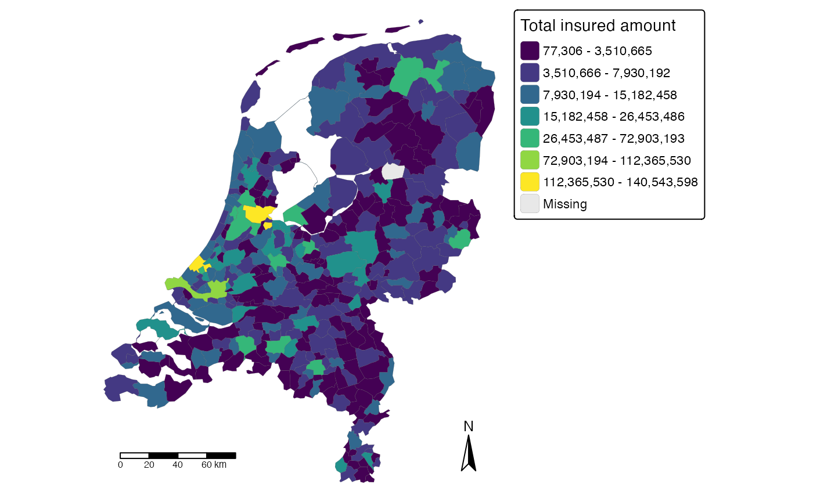

# Visualising spatial exposure

## Introduction

This vignette shows how point-level exposure data can be aggregated to
reporting areas and visualised as a choropleth map. Within
`spatialrisk`, this is primarily a reporting and communication workflow.

The fixed-radius concentration workflow answers a local risk question:
where is the largest accumulation within a circle of a specified
physical radius? Polygon-based visualisation answers a reporting
question: how is exposure distributed across administrative or
management areas?

Both views are useful, but they should not be interpreted as the same
measure.

## From point exposures to reporting areas

The example uses two data objects included in `spatialrisk`:

- `insurance`: point-level policy or risk locations with an `amount`
  column;
- `nl_gemeente`: municipal boundaries for the Netherlands.

``` r

library(spatialrisk)
library(sf)

point_exposures <- insurance[, c("lon", "lat", "amount")]

head(point_exposures)
#> # A tibble: 6 × 3
#>     lon   lat amount
#>   <dbl> <dbl>  <dbl>
#> 1  4.48  52.2  20000
#> 2  5.29  51.6 154965
#> 3  4.50  52.0 146078
#> 4  7.00  53.1 129304
#> 5  4.34  52.1  67636
#> 6  4.83  52.3  29971
```

The `amount` column represents the exposure measure that will be
aggregated. In an applied insurance setting this could be an insured
amount, total exposure value, risk premium, or another portfolio
quantity.

The reporting polygons define the spatial units used for communication.
Municipalities are used here as an example; the appropriate reporting
areas depend on the analytical or communication objective.

``` r

nl_gemeente[, c("id", "code", "areaname")]
#> Simple feature collection with 352 features and 3 fields
#> Geometry type: MULTIPOLYGON
#> Dimension:     XY
#> Bounding box:  xmin: 3.358378 ymin: 50.75136 xmax: 7.217623 ymax: 53.55362
#> Geodetic CRS:  WGS 84
#> First 10 features:
#>    id   code      areaname                       geometry
#> 1   1 GM0014     Groningen MULTIPOLYGON (((6.772527 53...
#> 2   2 GM0034        Almere MULTIPOLYGON (((5.350772 52...
#> 3   3 GM0037   Stadskanaal MULTIPOLYGON (((7.015446 53...
#> 4   4 GM0047       Veendam MULTIPOLYGON (((6.961735 53...
#> 5   5 GM0050      Zeewolde MULTIPOLYGON (((5.58907 52....
#> 6   6 GM0059 Achtkarspelen MULTIPOLYGON (((6.232173 53...
#> 7   7 GM0060       Ameland MULTIPOLYGON (((5.731096 53...
#> 8   8 GM0072     Harlingen MULTIPOLYGON (((5.472192 53...
#> 9   9 GM0074    Heerenveen MULTIPOLYGON (((5.92758 53....
#> 10 10 GM0080    Leeuwarden MULTIPOLYGON (((5.838649 53...
```

## Aggregate exposure by polygon

The function
[`summarise_points_by_polygon()`](https://mharinga.github.io/spatialrisk/reference/summarise_points_by_polygon.md)
spatially assigns point locations to polygon geometries and applies a
summary function. Here, the total insured amount is calculated for each
municipality.

``` r

municipality_exposure <- summarise_points_by_polygon(
  polygons = nl_gemeente,
  points = point_exposures,
  value = "amount",
  fun = sum,
  outside = "ignore"
)

sf::st_drop_geometry(municipality_exposure)[
  1:6,
  c("areaname", "amount_sum")
]
#>        areaname amount_sum
#> 1     Groningen   30218869
#> 2        Almere   30905436
#> 3   Stadskanaal    3080895
#> 4       Veendam    3721274
#> 5      Zeewolde    1887282
#> 6 Achtkarspelen    1313688
```

The result is still an `sf` object: it retains the municipal geometries
and adds the aggregated exposure column. This object can be used
directly for mapping.

## Create a choropleth

The
[`choropleth()`](https://mharinga.github.io/spatialrisk/reference/choropleth.md)
function shades polygons according to a numeric column. The `id`
argument identifies the column used for polygon labels in interactive
maps.

``` r

choropleth(
  municipality_exposure,
  value = "amount_sum",
  id = "areaname",
  legend_title = "Total insured amount"
)
```



This map shows how the total point-level exposure is distributed across
municipalities. The function returns a `tmap` object, so the map can be
further adjusted with `tmap` if a report requires additional formatting.

## Interpreting the map

A choropleth map represents values attached to predefined polygons. In
this example, each municipality is shaded according to the total insured
amount of point exposures assigned to that municipality.

This is useful for questions such as:

- which reporting areas contain the most exposure;
- how exposure is distributed across administrative areas;
- which municipalities or regions should be highlighted in a portfolio
  summary.

It does not directly answer where the highest local accumulation occurs
within a fixed physical radius. Polygon-level results depend on the
chosen boundaries. Two nearby risks may fall into different
municipalities, while exposures spread across a large municipality are
aggregated into a single polygon value. Administrative boundaries are
therefore reporting choices rather than part of the underlying
fixed-radius concentration problem.

## Relation to fixed-radius concentration

Polygon-based visualisation and fixed-radius concentration analysis are
complementary.

Polygon-based visualisation is useful for:

- reporting;
- portfolio summaries;
- communicating geographic patterns;
- administrative or management views.

Fixed-radius concentration analysis is useful for:

- local accumulation;
- identifying spatial hotspots;
- analysing concentration independently of administrative boundaries.

For physical accumulation questions, use
[`concentration_hotspot()`](https://mharinga.github.io/spatialrisk/reference/concentration_hotspot.md)
or the supporting fixed-radius functions described in
[`vignette("fixed-radius-concentration", package = "spatialrisk")`](https://mharinga.github.io/spatialrisk/articles/fixed-radius-concentration.md).
For reporting and communication, aggregate point exposures to relevant
polygons and visualise the resulting polygon-level values.

## Summary

This vignette demonstrated a complete polygon-based visualisation
workflow:

- start from point-level exposure data;
- assign points to reporting polygons;
- aggregate an exposure measure by polygon;
- visualise the polygon-level result with
  [`choropleth()`](https://mharinga.github.io/spatialrisk/reference/choropleth.md);
- interpret the map as a reporting view rather than a fixed-radius
  concentration measure.
